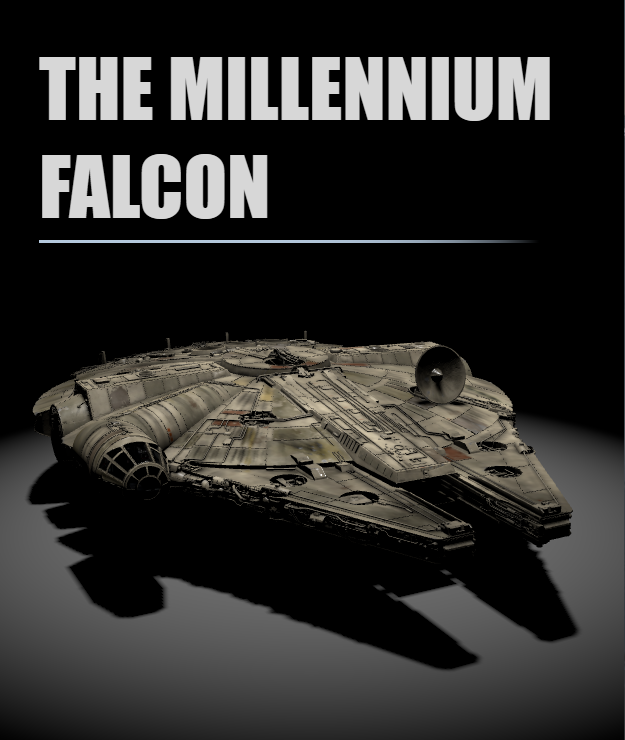
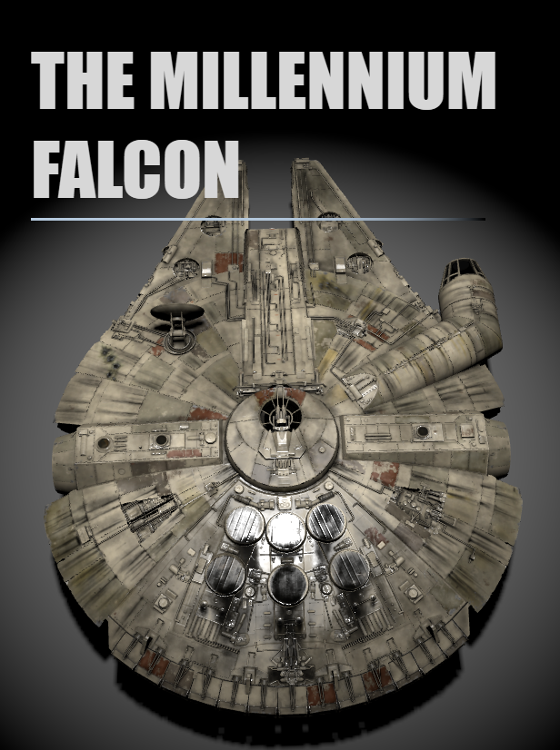

# Three.js Millennium Falcon Viewer

A responsive 3D viewer built using [Three.js](https://threejs.org/), HTML, CSS, and JavaScript, featuring the iconic **Millennium Falcon** from Star Wars. This project integrates a 3D model imported from [Sketchfab](https://sketchfab.com/3d-models/millennium-falcon-6a27ba566af142708743ccb8b4668d4b) and allows users to explore the model by interactively moving the camera. **Might take longer to load depending on PC Hardware**. **Doesnt work on mobile!!!**

<p align="center">
  
  
</p>

## Features

- 📱 **Responsive Design**: The model and renderer changes based upon device size.
- 🎮 **Interactive Camera**: Users can click and drag to rotate the camera around the Millennium Falcon model.
- 🌌 **3D Millennium Falcon Model**: The famous starship from the Star Wars universe, imported from Sketchfab and rendered in a Three.js scene.

## Demo

[Link to live demo: ](https://younes2808.github.io/StarWars_Falcon/)

## How to Run

1. Clone this repository:
   ```bash
   git clone https://github.com/younes2808/StarWars_Falcon/

## Technologies Used
<p>
<a href="https://threejs.org/" target="_blank" rel="noreferrer">
 
</a>
<a href="https://developer.mozilla.org/en-US/docs/Web/JavaScript" target="_blank" rel="noreferrer"></a>
<a href="https://developer.mozilla.org/en-US/docs/Glossary/HTML5" target="_blank" rel="noreferrer"></a>
</p>
